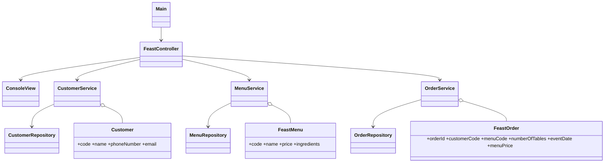
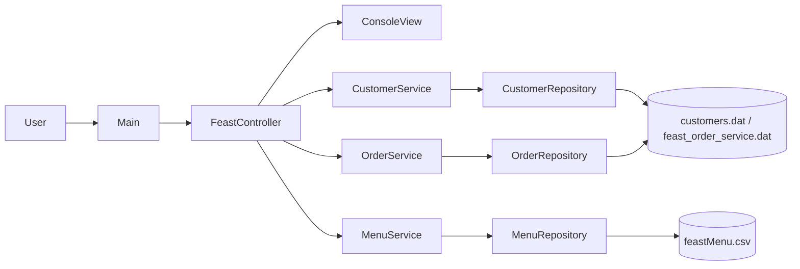
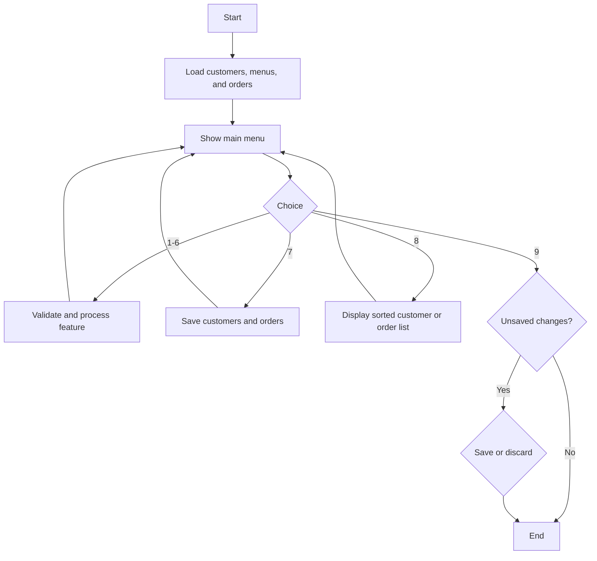
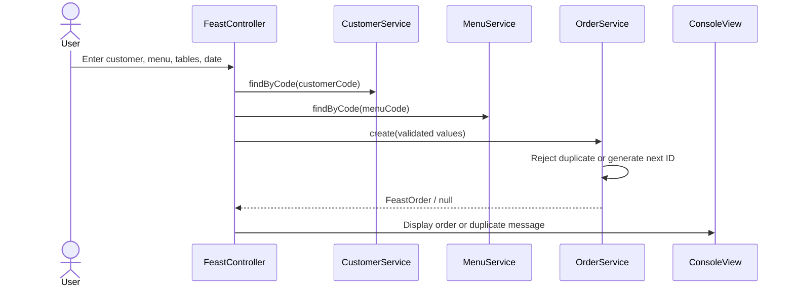

# Class Diagram

# Program Flowchart

The program follows a layered, component-oriented design. Dependencies point
inward from the console workflow toward business services and repositories.

The classes are organized into the same four packages as the supplied Sample:
`Entity`, `DataObject`, `Utilities`, and `Program`.

## Place-order sequence

